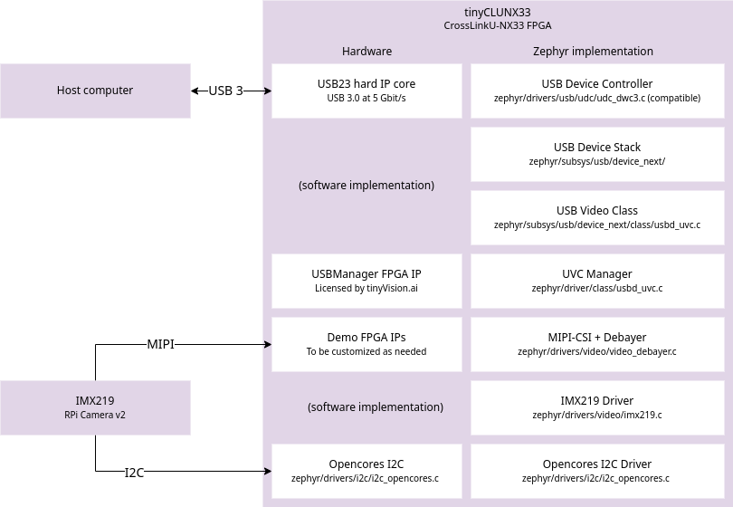

# Zephyr SDK {#appnote_zephyr_sdk}


## Repositories

The tinyCLUNX33 has an open-core model:

- [`tinyclunx33`](https://github.com/tinyvision-ai-inc/tinyclunx33)
  The **open-source part**: the base of the zephyr support: SoC and board definition and associated drivers and sample code.

- [`priv-tvai-usb`](https://github.com/tinyvision-ai-inc/priv-tvai-usb):
  The **private-access part** with extra resources for using the tinyCLUNX33 as a high-bandwidth video system.

The dependencies are managed with [West](https://docs.zephyrproject.org/latest/develop/west/index.html) like any Zephyr project.


## CI builds

The CI is rebuilding the firmware on every commit:

- `tinyclunx33` CI builds images are accessible here

- `priv-tvai-usb` CI builds images are accessible here


## Building the firmware

This guide uses the
[`tinyclunx33`](https://github.com/tinyvision-ai-inc/tinyclunx33)
sample application named `zephyr_shell`.

There are several targets for building the firmware, depending on what platform you wish to build on:

* **Board:** `tinyclunx33@rev1`, `tinyclunx33@rev2`
* **SoC:** `rtl_1_0`, `rtl_1_1`

Assuming a Board Rev2, a Devkit Rev2, and SoC RTLv1.0.3 being used:

1. Follow the general Zephyr to setup the build environment for your platform:
   <https://docs.zephyrproject.org/latest/develop/getting_started/index.html>

2. Reset the workspace directory you created from Zephyr's Getting Started Guide
   ```
   cd ~/zephyrproject
   rm -rf .west
   ```

3. Download the tinyCLUNX33 Zephyr example repository.
   This will also download the tinyVision Zephyr SDK as a dependency:
   ```
   west init -m https://github.com/tinyvision-ai-inc/tinyclunx33
   west update
   ```

4. Apply the patch for upstream USB 3 support.
   ```
   west patch apply
   ```

5. Build a sample application from this example repository, for instance `zephyr_cdc_raw` for
   [RTLv1.0.3](https://github.com/tinyvision-ai-inc/tinyclunx33/releases/tag/rtl_1_0_3).
   ```
   cd tinyclunx33/firmware/zephyr_cdc_raw
   west build --board tinyclunx33@rev2/rtl_1_0
   ```

6. Then, program the firmware into the devkit, with the DEBUG interface connected.
   ```
   west flash
   ```

7. Disconnect and reconnect the USB ports to power cycle the board, then you can see
   logs by connecting the DEBUG interface and use the 2nd serial console that shows-up,
   such as `/dev/ttyUSB1` in Linux, at baud rate `156200`. Once connected, press the reset
   switch (`SW2` on the Devkit Rev 2) to see the early boot logs appear.

See also [SoM Flash](som_flash.md) for other flash programming options.

You should now be able to see messages through the UART interface,
a new USB Video Class (UVC) interface showing-up on your operating system,
and if an IMX219 image sensor is connected, a video stream coming out of it.


## Zephyr Configuration

This app note describes the particular Zephyr configuration layout of the tinyCLUNX33.

The tinyCLUNX33 platform consists of several elements stacked on each others:

* **System-on-Chip (SoC)**
  ([`soc/tinyvision/tinyclunx33`](https://github.com/tinyvision-ai-inc/tinyclunx33/tree/zephyr/main/soc/tinyvision/tinyclunx33)):
  describing the peripherals implemented by the FPGA. There is one SoC version for each FPGA system
  image version. Defined at the Zephyr level as an
  [SoC](https://docs.zephyrproject.org/latest/hardware/porting/soc_porting.html).

* **System-on-Module (SoM):**
  ([`boards/tinyvision/tinyclunx33`](https://github.com/tinyvision-ai-inc/tinyvision_zephyr_sdk/tree/main/boards/tinyvision/tinyclunx33))
  describing the elements present on the tinyCLUNX33 module, defined at the Zephyr level as a
  [board](https://docs.zephyrproject.org/latest/hardware/porting/board_porting.html).

* **Devkit:**
  ([`boards/shields/tinyclunx33_devkit`](https://github.com/tinyvision-ai-inc/tinyvision_zephyr_sdk/tree/main/boards/shields/tinyclunx33_devkit))
  describing the devkit carrier board on which the tinyCLUNX33 module plugs into, defined at the
  Zephyr level as a [shield](https://docs.zephyrproject.org/latest/hardware/porting/shields.html).


## Zephyr Devicetree Configuraton

Most of the configuration boils down to
[devicetrees](https://docs.zephyrproject.org/latest/build/dts/index.html),
which describe the topology of the hardware, and permit the build system to know what driver to
select, and how to interconnect them.

The SoC, board and shield level all have variants according to the different versions of the
hardware or RTL. The `west build` command allow to specify which version exactly to select.

The top level definition of the devicetree happens in the board directory, but these are only
1-line wrappers over the full configuration, located in the
[`dts/riscv/tinyvision`](https://github.com/tinyvision-ai-inc/tinyvision_zephyr_sdk/tree/main/dts/riscv/tinyvision)
directory where all the content is:

* **`tinyclunx33_add_...`:** These files can be included to add an extra block of ready-made
  configuration to a design. For instance, the
  [`tinyclunx33_add_opencores_i2c.dtsi`](https://github.com/tinyvision-ai-inc/tinyvision_zephyr_sdk/blob/main/dts/riscv/tinyvision/tinyclunx33_add_opencores_i2c.dtsi)
  file *or* the
  [`tinyclunx33_add_litex_i2c.dtsi`](https://github.com/tinyvision-ai-inc/tinyvision_zephyr_sdk/blob/main/dts/riscv/tinyvision/tinyclunx33_add_litex_i2c.dtsi)
  file can be included to configure which I2C peripheral is present.

* **`tinyclunx33_rtl...`:** These files contain the top-level configuration for the various SoCs,
  describing all their content, and including the other `tinyclunx33_add_...` files to fill their
  configuration.

* **`tinyclunx33_custom.dtsi`:** This file serves as a minimal starting point for implementing a
  custom SoC. This allows application `app.overlay` configuration to define their own custom
  pipeline from the base SoC provided by tinyVision.ai, only selecting the drivers for which a
  peripheral is actually present.


## Building a firmware for a particular SoC

These devicetree variants permit the firmware developer to swap the version of any part of the
design at a firmware level:

For instance, one might be interested in testing a different RTL version, and for this, need to
adapt the firmware to be built for the appropriate RTL version.

Or for instance, one might be building a same firmware going into the devkit, or a firmware going
into a prototype, with different hardware on each case, which would need adaptation.

In order to adapt the firmware to all these different situations it is possible to pass flags to the
`west build` command that will select the correct panaché:

```
west build --board tinyclunx33@rev2/rtl_1_1
                   ~~~~~~~~~~~ ~~~~ ~~~~~~~
                   |           |    |
                   |           |    |
                   |           |    |
                   |           |    |
                   |           |    The RTL version, which can be /custom for
                   |           |    fully custom RTLs (see below).
                   |           |
                   |           The board revision, which depends on which moment
                   |           you acquired the SoM and Devkit.
                   |
                   The base board name which in this case is always "tinyclunx33"
```

## Video Pipeline



The tinyCLUNX33 is an [FPGA](https://en.wikipedia.org/wiki/Fpga) module, where the VexRiscv CPU
architecture is loaded from [flash](som_flash.md) at runtime, in addition to the peripherals
already provided by the FPGA fabric. Those are shown on the left of the diagram above.

On top of this, also from flash, the firmware is executed, with the Zephyr RTOS and drivers for
each hardware elements. Those are shown on the right on the diagram above.

This shows the path of the data on each hardware element (left side, for I/O), and the software
elements (right side, for control).


## Video elements

* **USB23 Hard IP:** The CrossLinkU-NX33 comes with a hardware USB 3 MAC that can be pushed
  up to 3.4 Gbit/s at the application layer.

* **USB Device Controller:** The Zephyr-side driver for the USB23 IP. The hardware API is for the
  most part compatible with DWC3 register interface, inspired from the standard XHCI, but for
  device-side rather than host-side.

* **USB Device Stack:** The core implementation of USB is provided by Zephyr, and maintained by its
  contributors. It is not involved in the data path of USB in the case of the tinyCLUNX33, which
  allows to reach higher speeds than what software handling allows. However, all the enumeration
  process and the control comands are handled with software by this USB stack.

* **USB Video Class:** The handling of the UVC protocol, aka the "webcam protocol", with all the
  control commands interfaced to video API calls, further turned into I2C calls by the video driver.

* **USB Manager FPGA IP:** The FPGA core that handles the high-speed data transfer over USB,
  directly at the hardware level, without involving the CPU, directly from the video source to the
  USB endpoint.

* **UVC Manager Driver:** The Zephyr-side implementation, that configures the USB Manager FPGA IP at
  boot-time.

* **Demo FPGA IPs:** FPGA-side implementation of a basic image pipeline, including MIPI and debayer
  allowing to get an image out without correction. This is the element that a custom solution would
  modify to fit a particular input sensor, or several of them.

* **MIPI-CSI + Debayer:** The Zephyr-side driver for the **Demo FPGA IPs** that might be modified as
  well along with the FPGA side.

* **IMX219 Driver:** The Zephyr-side implementation of the IMX219 image sensor driver, sending
  commands over I2C according the the Video API. It receives the Video API calls from the UVC
  driver. This driver can be swapped with any other image sensor driver.

* **Opencores I2C:** An I2C controller that permits to communicate with the image sensor(s) and
  other I2C peripherals.

* **Opencores I2C Driver:** The Zephyr-side implementation of the I2C peripheral.


## Pipeline driver setup

Like any Zephyr video driver, this video pipeline is using the
[devicetree](https://docs.zephyrproject.org/latest/build/dts/index.html)
to interconnect the drivers together. The syntax used is inherited from Linux taken as inspiration:

```
video0: video@12300000 {
	compatible = "example,video-source";
	port {
		video0_ep_out: endpoint {
			remote-endpoint-label = "video1_ep_in";
		};
	};
};

video1: video@12400000 {
	compatible = "example,video-sink";
	port {
		video1_ep_in: endpoint {
			remote-endpoint-label = "video0_ep_out";
		};
	};
};
```

This shows an interconnection between two video processing elements: a source `video0` upstream
sending data to a `video1` downstream.

The `port` and `endpoint` represent the input or output connection with the other video processing
element, and the `remote-endpoint-label` specifies the name of the other endpoint with which the
current endpoint is connected.

This forms a bidirectional reference between the two video elements that is used by the drivers to
know what is the next and previous driver in the chain.

In order to facilitate the configuration, the tinyCLUNX33 video elements are already pre-integrated
as seen
[here](https://github.com/tinyvision-ai-inc/priv-tvai-usb/tree/main/zephyr/dts/riscv/tinyvision),
and turned off by default.

This permits to keep the applications compact, which only need to turn on the drivers they use, as
seen
[here](https://github.com/tinyvision-ai-inc/priv-tvai-usb/blob/main/firmware/zephyr_imx219/app.overlay).

The syntax to enable a core in Zephyr is:

```
&video0 {
	status = "okay";
};
```

The `&` of `&video0` is there to refer to an existing node defined elsewhere.

Other driver parameters can be described as well in addition to `status`, for instance to change the
default values provided by the global configuration.

See the [Zephyr configuration](appnote_zephyr_configuration.md) for a detailed review of these
configuration files.

## Troubleshooting

The first sign of life from the Zephyr RTOS comes the UART interface, available by plugging the DEBUG USB cable.

In order to get early boot logs, you can hit the SW2 button which will reset the board but keep the serial console attached.

The Zephyr shell will be available over that same UART interface as the debug logs (except for the `zephyr_shell` sample code).
For the Shell example, this goes through the DATA USB port, `/dev/ttyACM0`.

These debug commands permit to review the internal state of the various peripherals.

If nothing comes through the UART, see the
[FPGA troubleshooting](https://tinyclunx33.tinyvision.ai/som_fpga.html#autotoc_md67)
section.

If getting any issue reproducing results, the
[CI job](https://github.com/tinyvision-ai-inc/tinyclunx33/actions/workflows/zephyr.yml)
defined
[here](https://github.com/tinyvision-ai-inc/tinyclunx33/blob/main/.github/workflows/zephyr.yml)
will act as a verifiable and reproducible reference.
