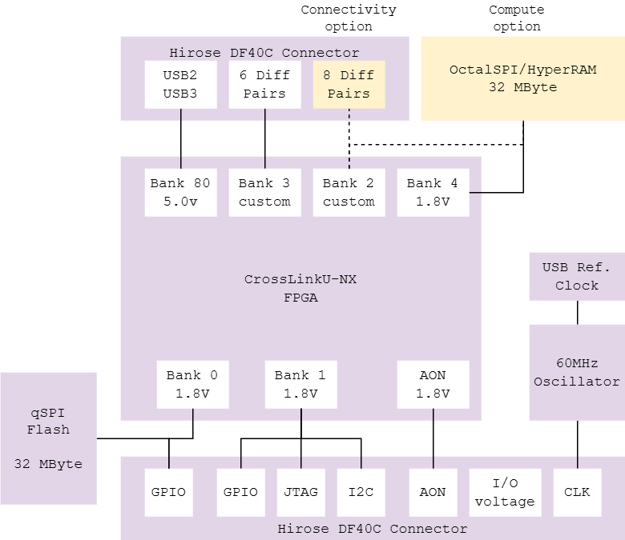

# SoM Hardware {#som}

26mm x 26mm x 4.5mm module, industrial temperature grade: -40°C to +85°C

@subpage som_clocks
@subpage som_flash
@subpage som_fpga
@subpage som_gpio
@subpage som_i2c
@subpage som_jtag
@subpage som_memory
@subpage som_mipi
@subpage som_pinout
@subpage som_power
@subpage som_usb

Connector:
- 2x Hirose high density DF40C 60 pin connectors
- proven on thousands of SoM's in the field in high vibration environments
- Spare pins for future proofing

2 flavors:
- Connectivity: 14 diff pairs, no SSRAM
- Compute: 8 diff pairs, 32 MB [oSPI/HyperRAM](som_memory.md) @ <0.5GBps

I/O interfaces:
- Internal 60MHz or external clock option for full flexibility in application
- GPIO, I2C, field updates through FPGA (under development) or direct flash programming over JTAG
- Programmable bank voltages to enable glueless interfaces

Firmware/RTL:
- Zephyr for control path on RISCv
- No-code graphical RTL generator with large # of IP blocks

Development boards:
- [devkit] for programming/debug
- Adapter boards for various camera connectors and expansion
- Reference design for a compact camera device

